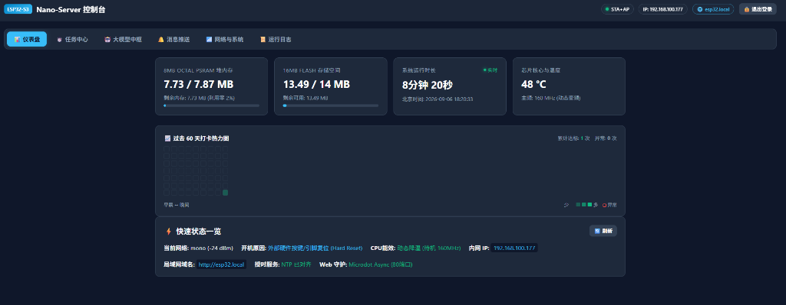
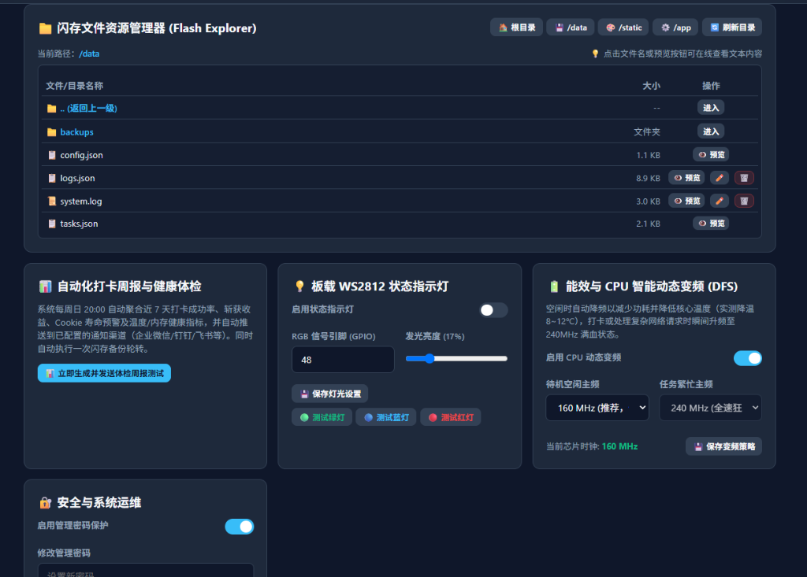
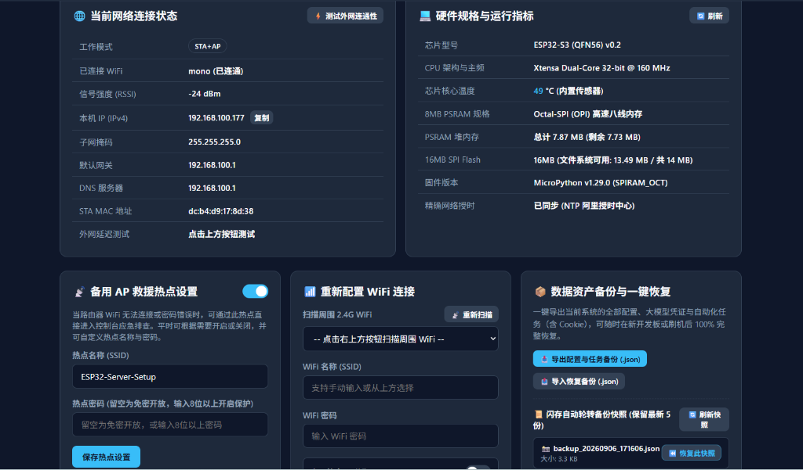
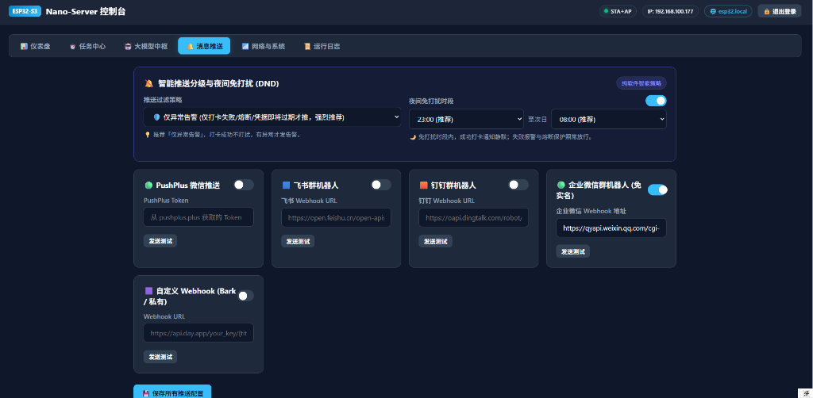

<div align="center">

# ⚡ ESP32-S3 Nano-Server
### 全功能微型物联网服务器 & 智能自动化打卡中枢


<p align="center">
  <b>一台巴掌大小、年耗电不到 2 块钱的 24 小时不间断运行的嵌入式 Nano-Server。</b><br>
  集成了异步 Web 服务器、拟人化时间窗口打卡、Cookie 智能续期与寿命监测、GitHub 风格贡献热力图、大模型故障自愈诊断、多通道告警推送、CPU 智能动态变频与掉电安全闪存资产管理。
</p>

[✨ 功能亮点](#-核心功能亮点) • [📸 界面截图](#-界面预览) • [🔌 硬件兼容](#-硬件支持与兼容性) • [🚀 快速开始](#-快速开始-从零到一键部署) • [📖 使用手册](#-核心玩法与使用手册) • [❓ 常见问题](#-常见问题-faq)

</div>

---

## 📸 界面预览

<div align="center">
  <h3>📊 仪表盘主页 & 过去 60 天打卡日历热力图</h3>
  
</div>

<br />

<div align="center">
  <h3>📁 闪存文件资源管理器、CPU 智能变频与状态指示灯</h3>
  
</div>

<br />

<div align="center">
  <h3>🌐 网络连接状态、硬件指标与数据资产一键备份/恢复</h3>
  
</div>

<br />

<div align="center">
  <h3>🔔 多通道消息推送、智能过滤分级与夜间免打扰 (DND)</h3>
  
</div>

---

## ✨ 核心功能亮点

### 1. 🚀 纯异步高性能微架构
- **零外部运行时依赖**：基于 MicroPython 异步网络框架 (Microdot Async)，单芯片支撑 HTTP API、静态网页流式传输与后台 Cron 协同调度。
- **现代化极简深色 Web 控制台**：单文件全异步微前端设计，支持 PWA 离线缓存、桌面/手机移动端自适应布局。
- **局域网专属域名直达 (mDNS)**：内置 mDNS 广播，局域网中直接访问 `http://esp32.local` 即可直达控制台，告别频繁查找内网动态 IP 的繁琐。

### 2. 🔋 CPU 智能动态变频 (DFS 降温技术)
- **温控与低功耗革命**：待机时自动降频至 **160MHz**（或极致节能 **80MHz**），核心温度直降 **8~12°C**（实测待机温度降至 38~48°C）；
- **按需狂暴升频**：在触发自动化任务执行、网络请求处理或高并发访问瞬间，毫秒级拉升至 **240MHz 满血双核状态**，任务结束后自动回落；
- **总线时钟稳定**：在 160MHz/80MHz 下 ESP32-S3 内部 APB 总线维持 80MHz，WiFi 连接与 UART 串口通信极其稳定。

### 3. 🎲 区间拟人化时间窗口 (防风控打卡)
- **消除机械打卡指纹**：不仅支持标准固定时间点与 Cron 表达式，更有创新的 **拟人化时间窗口模式**（如 `08:30-09:15`）；
- **每日动态随机**：系统在每天清晨自动随机抽取区间内的 1 个精准分钟点执行（如今天 08:43、明天 09:07），当天不再重复触发，彻底模拟真人行为习惯。

### 4. 📈 GitHub 风格 60 天贡献热力图 (Activity Heatmap)
- 仪表盘直观展现过去 60 天每日打卡战报方块矩阵；
- 绿色多级深浅直观反映完成频次，打卡失败或异常自动以红色高亮边框示警，鼠标悬停可查看详细达标数据。

### 5. 🍪 Cookie 全生命周期智能管理
- **JWT 凭据寿命无感解析**：自动解析 Cookie 中的 JWT 载荷，提取 `exp` 失效时间戳，在任务卡片上以红/黄/绿直观展现剩余有效期倒计时；
- **滚动捕获续期 (Auto Cookie Refresh)**：自动捕获服务响应头中的 `Set-Cookie`，并无感回写更新任务配置，实现凭据永久保活；
- **⚡ 浏览器「一键更新 Cookie」书签工具**：提供专属 JavaScript 书签工具，在电脑浏览器打开目标网站时点击书签，即可一键把当前有效 Cookie 跨域推送同步到 ESP32，无需打开 F12 繁琐抓包。

### 6. 🔬 板载在线 Mini Postman HTTP 调试台
- 免开电脑、免装 Postman，直接在 ESP32 控制台上发起任意 GET/POST/PUT/DELETE 请求；
- 完整展示响应状态码、网络耗时、响应头明细列表，以及自动提取捕获的 `Set-Cookie` 字段。

### 7. 🤖 大模型故障诊断中枢 (AI Diag)
- 支持接入任意兼容 OpenAI 协议的模型 API（如 DeepSeek、通义千问、Kimi、硅基流动、GLM、ChatGPT 等）；
- 当自动化任务打卡失败时，自动提取 HTTP 返回内容并请求大模型，生成精准的单行中文故障根因诊断建议（如“Cookie 已失效”、“触发图形验证码”、“对方接口维护中”等）。

### 8. 🔕 智能推送分级与夜间免打扰 (DND)
- **支持多通道统一推送**：企业微信机器人（免实名个人可用）、飞书机器人、钉钉机器人、PushPlus 微信推送、自定义 Webhook (Bark / Server酱 / 私有服务)；
- **三档推送策略**：`全部推送` / `🛡️ 仅异常告警（推荐）` / `彻底静默`；
- **夜间免打扰时段**：自定义免打扰区间（如 23:00 至次日 08:00），成功打卡静默不打扰，仅关键故障放行告警；
- **自动周报与健康体检**：每周日 20:00 自动聚合近 7 天打卡成功率、Cookie 寿命预警与温度/内存健康指标推送到群聊。

### 9. 📁 闪存文件管理与全方位系统安全
- **闪存简易文件浏览器**：在线浏览 `/data` 目录树与文件大小，支持文本在线预览、重命名与一键清理；
- **防砖安全防护墙**：禁止对 `/main.py`、`/boot.py`、`/app/*`、`/static/*` 及核心配置进行修改删除，彻底防止误操作变砖；
- **掉电安全与原子化写操作**：LittleFS 掉电保护 + 临时文件交换原子落盘，**日常运行随时拔掉电源 100% 安全**；
- **控制台防暴力破解**：连续 5 次输错密码自动锁定 5 分钟并启动动态倒计时，写入内核安全审计日志；
- **物理 BOOT 键 5 秒救砖**：换路由器或网络连不上时，长按板载 BOOT 键 5 秒即可清空 WiFi 配置并秒启救援 AP 热点！

---

## 🔌 硬件支持与推荐配置

本项目是针对 **ESP32-S3 双核微控制器** 打造的富功能嵌入式 Web 服务器平台（全套 49 个 RESTful API + 现代化微前端 Web 控制台 + 任务调度器 + AI 诊断引擎）：

| 硬件系列 | 芯片架构与主频 | 板载内存支持 | 兼容状态 | 常见推荐开发板型号 |
| :--- | :--- | :--- | :--- | :--- |
| **ESP32-S3 系列 (带 PSRAM)** | Xtensa® 双核 240MHz | 2MB / 8MB / 16MB PSRAM | 🌟 **完全原生支持（首选）** | 乐鑫官方 DevKitC-1、合宙 ESP32-S3、YD-ESP32-S3 (双Type-C)、立创开源S3 等 (N8R8 / N16R8) |
| **经典 ESP32 / ESP32-C3** | 单核/双核 (无外部 PSRAM) | 仅 ~120KB 可用堆 | ❌ **不兼容 / 不支持** | 经典 ESP32-WROOM、ESP32-C3 等由于板载 SRAM 极小，无法承载 49 个 API 与并发 Web 流量 |

> [!IMPORTANT]
> **硬件唯一支持说明**：
> - **必须使用 ESP32-S3 系列开发板**（强烈推荐搭载 8MB/16MB Flash 与 8MB Octal/Quad PSRAM，如市面通用的 **N8R8** 或 **N16R8** 规格），可提供 >7.8MB 可用堆内存，完美流畅运行所有后台 API、大模型诊断与前端流式界面。
> - **为什么不支持经典 ESP32 与 ESP32-C3？**：经典 ESP32-WROOM 与 ESP32-C3 普遍无板载外部扩展 PSRAM，启动 MicroPython 后系统剩余可用堆内存仅剩约 20~30KB。在多协程任务、lwIP 网络协议栈分配 socket buffer 以及传输前端单页静态资源时，会直接因内存碎片枯竭触发 OOM（内存溢出）或连接挂起无响应。因此本项目**严格限定在 ESP32-S3 开发板**上运行。

- **Flash 存储**：支持 **4MB / 8MB / 16MB SPI Flash**（自动动态计算容量与配额）；
- **PSRAM 内存**：原生支持 **Octal-SPI / Quad-SPI PSRAM**（自动管理可用堆内存）；
- **芯片智能校验**：`deploy.py` 一键部署工具会自动通过硬件串口校验芯片类型，非 ESP32-S3 会自动拦截提示，并自动烧录对应的官方 S3 固件。

---

## 🚀 快速开始 (从零到一键部署)

我们为开源用户编写了极速一键部署工具 [`deploy.py`](file:///d:/python项目/ESP32/deploy.py)，仅需一条命令即可完成固件刷写与完整系统的上传。

### 步骤 1：克隆项目与安装环境

在电脑（Windows / macOS / Linux 均可）上打开终端：

```bash
# 1. 克隆本仓库
git clone https://github.com/Carton-qin/esp32-s3-nano-server.git
cd esp32-s3-nano-server

# 2. 安装部署所需的 Python 依赖工具 (mpremote, esptool, pyserial)
pip install -r requirements.txt
```

### 步骤 2：连接开发板并一键部署

将 ESP32-S3 开发板通过 Type-C 数据线连接至电脑 USB 口：

```bash
# 首次使用或全新刷机（全自动 S3 架构校验 + 擦除 Flash + 智能烧录 S3 固件 + 同步代码）：
python deploy.py --flash

# 日常代码热更新（仅同步修改的代码与页面，不擦除固件与配网数据）：
python deploy.py
```

### 步骤 3：初始 AP 热点与网页配网（标准配网流程）

系统部署完成后，开发板将自动广播救援与初始配网热点：

1. **连接热点**：打开手机或电脑的 WiFi 列表，搜索并连接：
   - **热点名称 (SSID)**：`ESP32-Server-Setup`
   - **热点密码**：**无密码**（免密开放）
2. **打开配网后台**：
   - 手机连接后通常会自动弹出配网登录窗口；
   - 若未自动弹窗，在手机或电脑浏览器直接打开：
     ```text
     http://192.168.4.1
     ```
3. **输入初始管理员密码**：
   - 默认密码：`admin`
4. **选择 WiFi 并一键连接**：
   - 进入控制台「网络与系统 -> 重新配置 WiFi 连接」；
   - 点击「📡 重新扫描」，从下拉菜单中选中您的家庭/办公室 2.4G WiFi；
   - 输入 WiFi 密码，点击「连接 WiFi 并保存」；
   - 开发板将即刻连入路由器，并在网页中弹出分配到的内网 IP（例如 `192.168.100.177`）。
5. **日常使用与直达**：
   - 手机或电脑切回同一家庭/办公室 WiFi；
   - 浏览器直接访问内网专属域名：
     ```text
     http://esp32.local
     ```
     或直接访问上面分配到的内网 IP 即可永久直达！

> 💡 **小贴士**：
> - `deploy.py` 会**自动扫描串口**并**自动校验 ESP32-S3 芯片架构**；
> - 仓库根目录已预置乐鑫官方最新版 ESP32-S3 固件：`ESP32_GENERIC_S3-SPIRAM_OCT-20260824-v1.29.0.bin`；
> - **[可选进阶参数]**：若您在自动化批处理部署时希望直接通过命令行写死 WiFi，亦可追加 `--wifi "SSID" "密码"` 参数跳过网页配网。

---

## 📖 核心玩法与使用手册

### 1. 修改默认管理员密码
首次登录进入后台后，建议在「网络与系统 -> 安全与系统运维」中将默认密码 `admin` 修改为您自己的专属安全密码。

### 2. 添加自动化打卡与监控任务
1. 在控制台切换到「任务中心」，点击右上角「+ 新建任务」；
2. 输入任务名称、目标 URL、请求方法 (GET/POST)、请求头 Headers（填入 Cookie 或鉴权凭据）以及成功断言关键字；
3. 选择调度策略：支持「🎲 拟人化时间窗口 (如 08:30-09:15，每天随机执行防风控)」、「每日固定时刻」或「Linux Crontab 表达式」；
4. 点击保存即可。在任务卡片上点击「▶ 立即运行」，即可现场测试接口与打卡连通性。

---

### 3. 配置微信 / 飞书 / 钉钉告警推送
1. 切换到「消息推送」选项卡；
2. 推荐保持推送策略为「🛡️ 仅异常告警」，打卡成功时静默，仅在 Cookie 即将失效或连续失败时推送；
3. 根据需要填入以下任一通道的 Token 或 Webhook：
   - **企业微信群机器人**（免实名，企业微信群右键添加机器人获取 Webhook，推荐）；
   - **飞书群机器人** / **钉钉群机器人**；
   - **PushPlus 微信推送**（关注公众号获取 Token）；
   - **自定义 Webhook**（支持 iOS Bark、Server酱等）；
4. 点击各个模块下的「发送测试」，手机收到推送后点击「保存所有推送配置」。

---

### 4. 浏览器「一键更新 Cookie」书签工具使用
1. 切换到「网络与系统」选项卡，找到「电脑浏览器一键更新 Cookie 书签工具」；
2. 按照界面提示，将提供的 JS 代码保存为浏览器的收藏夹书签；
3. 平时在电脑浏览器正常登录目标网站后，只需点击一下该书签；
4. 书签将自动提取当前站点的有效 Cookie，并跨域静默同步推送到您的 ESP32 中，彻底告别 F12 抓包！

---

## ❓ 常见问题 (FAQ)

#### Q1: 这个设备需要关机吗？可以直接拔电源断电吗？
> **A: 完全可以直接断电拔插头！**
> ESP32 属于裸机微控制器，没有传统操作系统繁重的磁盘写缓存。系统底层采用针对掉电安全的 LittleFS 文件系统，配置文件与任务数据库均应用了**原子化安全落盘机制 (Atomic Swap)**。无论是在待机还是运行中，随时直接拔掉 Type-C 数据线 100% 安全，不会导致数据损坏或系统变砖。再次通电 1 秒即可秒速自启恢复。

#### Q2: 换了路由器或者 WiFi 密码改了，连不上控制台怎么办？
> **A: 长按板载【BOOT 键 5 秒】即可一键物理救砖！**
> 只要长按 ESP32 板载的 BOOT 按键 5 秒，RGB 指示灯将紫闪示警，系统会自动清空旧的 WiFi 配置并立即开启 `ESP32-Server-Setup` 救灾热点。手机重新连接该热点，在 `http://192.168.4.1` 重新配网即可。

#### Q3: 我的开发板没有 RGB 灯，或者 RGB 引脚不是 GPIO 48 怎么办？
> **A: 完全不受影响，且支持后台自由配置！**
> - 如果您的开发板没有 RGB 灯，系统底层具备异常安全捕获机制，会自动静默跳过硬件输出，所有网络和打卡功能 100% 正常运行。
> - 如果您的开发板 RGB 灯连接在其他引脚（如 GPIO 38 或 GPIO 8），只需在控制台「网络与系统 -> 板载 WS2812 状态指示灯」中输入对应的引脚编号，点击保存即可生效。

#### Q4: 长期插电运行会不会发热？
> **A: 核心温度仅约 38~48°C，温热微凉，非常健康！**
> 系统内置了 **CPU 智能动态变频 (DFS)**，待机时芯片自动降频至 160MHz 或 80MHz，实测芯片温度比传统常驻 240MHz 降低 8~12°C。整机功耗仅约 0.3W~0.5W，常年插在普通手机充电头、路由器 USB 口或插座上均可稳定运行。

---

## 📂 项目结构

```text
esp32-s3-nano-server/
├── deploy.py                  # 一键固件烧录与代码同步部署工具
├── requirements.txt           # 电脑端部署依赖库
├── ESP32_GENERIC_S3-*.bin     # 预置 MicroPython 固件二进制文件
├── .gitignore                 # Git 忽略配置（防泄露私有数据）
├── docs/
│   └── images/                # 系统界面高清实测截图
└── root/                      # ESP32 板载运行根目录
    ├── boot.py                # 开机第一引导脚本
    ├── main.py                # 主入口（看门狗、NTP、变频管理、微服务调度）
    ├── microdot/              # MicroPython 高性能异步 Web 框架
    ├── static/
    │   └── index.html         # 现代化全功能单文件响应式控制台 (Micro-FrontEnd)
    └── app/                   # 核心业务模块
        ├── config.py          # 原子化配置/任务持久化管理器与写损耗均衡
        ├── cron.py            # Cron & 拟人化时间窗口动态抽取调度器
        ├── executor.py        # 任务执行器、断言匹配、JWT Cookie 寿命探测
        ├── http_client.py     # 异步 HTTP 请求客户端与 Mini Postman 引擎
        ├── llm.py             # 大模型故障智能诊断驱动 (OpenAI 协议兼容)
        ├── notify.py          # 多通道消息推送网关与智能免打扰拦截
        ├── wifi.py            # WiFi STA/AP 双模驱动与 mDNS 局域网域名解析
        ├── led.py             # WS2812 硬件指示灯与色彩管理
        └── button.py          # 物理 BOOT 键 5 秒救砖按键侦听器
```

---

## 📄 开源协议

本项目基于 [MIT License](LICENSE) 开源发布，欢迎提交 Issue 与 Pull Request 共同改进！
